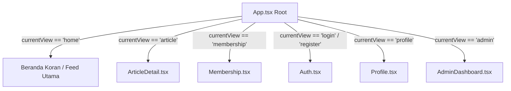

# 📖 Dokumentasi & Penjelasan Kode Proyek Web Portfolio

Dokumen ini berisi penjelasan lengkap mengenai struktur folder, arsitektur kode, fungsionalitas setiap komponen, serta aliran logika utama dalam proyek **Web Portfolio & Digital Media ("The Vibey Sunday Media")**.

---

## 📑 Daftar Isi
1. [Gambaran Umum Proyek](#1-gambaran-umum-proyek)
2. [Struktur Direktori Proyek](#2-struktur-direktori-proyek)
3. [Penjelasan File Utama & Entry Point](#3-penjelasan-file-utama--entry-point)
4. [Penjelasan Komponen-Komponen Utama](#4-penjelasan-komponen-komponen-utama)
   - [App.tsx (Main Application & Layout)](#apptsx)
   - [Membership.tsx (Halaman Langganan/Membership)](#membershiptsx)
   - [AdminDashboard.tsx (Panel Kontrol Admin)](#admindashboardtsx)
   - [Auth.tsx (Autentikasi Login & Register)](#authtsx)
   - [Profile.tsx (Halaman Profil Pengguna)](#profiletsx)
   - [ArticleDetail.tsx (Detail Artikel & Pembaca)](#articledetailtsx)
   - [lib/supabase.ts (Konfigurasi Client Supabase)](#libsupabasets)
5. [Komponen UI Reusable (Shadcn UI)](#5-komponen-ui-reusable-shadcn-ui)
6. [Manajemen State & Navigasi Halaman](#6-manajemen-state--navigasi-halaman)
7. [Integrasi Backend & Database (Supabase)](#7-integrasi-backend--database-supabase)

---

## 1. 🌟 Gambaran Umum Proyek

Aplikasi web ini adalah portofolio interaktif berbentuk **Koran / Media Digital Editorial Premium** dengan nama *"The Vibey Sunday Media"*. Aplikasi ini menggabungkan tampilan gaya jurnalisme klasik (*editorial serif design*) dengan fungsionalitas aplikasi web modern (*React + Vite + TypeScript*).

### Tech Stack Utama:
- **Frontend Framework**: React 18 + Vite + TypeScript
- **Styling**: Tailwind CSS + CSS Custom Properties (Typography Serif & Sans-serif)
- **UI Components**: Shadcn UI (terbangun di atas Radix UI Primitives)
- **Icons**: Lucide React Icons
- **Chart / Analytics**: Recharts
- **Backend & Database**: Supabase Client (`@supabase/supabase-js`)

---

## 2. 📁 Struktur Direktori Proyek

```text
web_porto/
├── public/                 # Aset statis yang di-serve langsung
├── src/                    # Source code utama aplikasi
│   ├── app/
│   │   ├── App.tsx         # Root component & pengatur navigasi/state
│   │   └── components/     # Komponen-komponen fitur utama
│   │       ├── AdminDashboard.tsx  # Halaman Dashboard Admin
│   │       ├── ArticleDetail.tsx   # Halaman Detail Baca Artikel
│   │       ├── Auth.tsx            # Form Login & Registrasi
│   │       ├── Membership.tsx      # Halaman Paket Langganan / Membership
│   │       ├── Profile.tsx         # Halaman Profil User & Histori
│   │       ├── figma/              # Asset/komponen impor Figma
│   │       └── ui/                 # Komponen UI Shadcn (Button, Card, Modal, Table, dll)
│   ├── imports/            # Gambar & aset impor khusus
│   ├── lib/
│   │   └── supabase.ts     # Inisialisasi Klien Supabase
│   ├── styles/
│   │   ├── fonts.css       # Definisi Google Fonts (Playfair Display, PT Serif, Lato)
│   │   ├── globals.css     # Utility CSS global
│   │   ├── index.css       # File masukan CSS utama
│   │   ├── tailwind.css    # Directives Tailwind CSS
│   │   └── theme.css       # Variabel warna & tema Shadcn UI
│   └── main.tsx            # Entry point aplikasi React ke DOM
├── .env.example            # Template variabel lingkungan
├── package.json            # Daftar dependensi & npm scripts
├── README.md               # Dokumentasi umum & roadmap proyek
└── vite.config.ts          # Konfigurasi bundler Vite
```

---

## 3. 🚀 Penjelasan File Utama & Entry Point

### `src/main.tsx`
File ini adalah **titik awal (entry point)** eksekusi aplikasi oleh browser:
- Mengimpor `createRoot` dari `react-dom/client`.
- Mengimpor file gaya utama `src/styles/index.css`.
- Mengaitkan elemen `<div id="root">` dari `index.html` dengan komponen utama `<App />`.

### `src/lib/supabase.ts`
File modul helper untuk menghubungkan aplikasi React dengan backend **Supabase**:
```typescript
import { createClient } from '@supabase/supabase-js';

const supabaseUrl = import.meta.env.VITE_SUPABASE_URL || '';
const supabaseAnonKey = import.meta.env.VITE_SUPABASE_ANON_KEY || '';

export const supabase = createClient(supabaseUrl, supabaseAnonKey);
```
- Mengambil environment variable `VITE_SUPABASE_URL` dan `VITE_SUPABASE_ANON_KEY`.
- Membuka koneksi API ke Supabase agar bisa digunakan untuk query database PostgreSQL, auth, maupun storage.

---

## 4. 🧩 Penjelasan Komponen-Komponen Utama

### `src/app/App.tsx`
Merupakan **pusat kontrol utama (Root Component)** seluruh aplikasi.
- **State Navigasi (`currentView`)**: Mengatur tampilan layar aktif (`"home"`, `"article"`, `"membership"`, `"login"`, `"register"`, `"profile"`, `"admin"`).
- **Fitur Header Koran**:
  - Ticker berita running text.
  - Tanggal real-time & informasi cuaca.
  - Logo besar bergaya koran "The Vibey Sunday Media".
  - Mega Menu Kategori (Engineering & Data, Design & Creative, Operations & Strategy).
- **Fitur Utama**:
  - Filter interaktif berdasarkan kategori/sub-kategori.
  - Drawer Pencarian (*Search Drawer*) dengan filter teks instan.
  - Fitur Bookmark artikel (Bookmark state).
  - Modal kontak & form berlangganan newsletter.

---

### `src/app/components/Membership.tsx`
Komponen untuk memamerkan pilihan paket keanggotaan/langganan bagi pengguna:
- **Grid Kartu Harga**: Menampilkan perbandingan paket **Gratis (Rp 0)** dan **Premium (Rp 49.000/bulan)**.
- **Tabel Perbandingan Fitur**: Menggunakan komponen `Table` Shadcn untuk membandingkan manfaat akses artikel eksklusif, bebas iklan, buletin harian, dll.
- **FAQ Accordion**: Menampilkan daftar pertanyaan yang sering diajukan dengan animasi *collapse/expand* menggunakan `Accordion`.

---

### `src/app/components/AdminDashboard.tsx`
Panel manajemen khusus admin/penulis berita:
- **Kartu Ringkasan Statistik**: Menampilkan total artikel, total pengguna, member premium, dan kategori dengan indikator persentase pertumbuhan.
- **Grafik Analitik Publikasi**: Menggunakan pustaka `Recharts` (`BarChart`, `ResponsiveContainer`) untuk memvisualisasikan tren artikel per bulan.
- **Tabel Kelola Artikel**: Menampilkan daftar artikel beserta status (*Published* / *Draft*) dan tipe (*Premium* / *Gratis*).
- **Modal Tambah Artikel Baru**: Dialog form interaktif untuk menginput judul, kategori, penulis, dan status artikel.

---

### `src/app/components/Auth.tsx`
Komponen formulir autentikasi pengguna:
- **Mode Berdiri Dual (Login & Registrasi)**: Beralih antarmuka secara dinamis sesuai prop `initialMode`.
- **Formulir Input**: Input Email, Password, serta Nama Lengkap (untuk mode pendaftaran).
- **Tombol Social Auth**: Menyediakan opsi masuk cepat menggunakan Google OAuth.

---

### `src/app/components/Profile.tsx`
Halaman dasbor profil pengguna yang terautentikasi:
- **Header Profil**: Informasi nama, email, avatar, serta lencana status keanggotaan (*Premium* / *Free*).
- **Daftar Artikel Tersimpan (Saved Articles)**: Menampilkan artikel yang sudah ditandai/dibookmark oleh pengguna.
- **Riwayat Membaca (Reading History)**: Catatan artikel yang baru saja dibaca.
- **Pengaturan Akun & Notifikasi**: Tombol *toggle switch* untuk mengaktifkan/mematikan email newsletter & pengingat artikel.

---

### `src/app/components/ArticleDetail.tsx`
Halaman tampilan lengkap untuk membaca satu artikel pilihan:
- **Bar Kemajuan Membaca (Reading Progress)**: Indikator persentase *scroll* saat pengguna membaca artikel.
- **Pengatur Ukuran Teks (Font Sizer)**: Pilihan untuk memperbesar/memperkecil ukuran font bacaan.
- **Aksi Interaktif**: Tombol Cetak Artikel, Bookmark, dan Bagikan ke media sosial.
- **Seksi Komentar**: Area diskusi antar pembaca.

---

## 5. 🛠️ Komponen UI Reusable (Shadcn UI)

Folder `src/app/components/ui/` berisi komponen antarmuka yang modular dan dapat digunakan kembali (*reusable components*):

| Komponen UI | Kegunaan Utama |
| :--- | :--- |
| `button.tsx` | Tombol interaktif dengan varian *default*, *outline*, *ghost*, *destructive*. |
| `card.tsx` | Kontainer bergaya kartu untuk artikel, statistik, dan paket harga. |
| `table.tsx` | Elemen tabel terstruktur untuk data admin dan perbandingan paket. |
| `dialog.tsx` | Jendela pop-up modal (misal: tambah artikel, info detail). |
| `accordion.tsx` | Elemen lipat-buka untuk FAQ dan menu bertingkat. |
| `badge.tsx` | Label status kecil (*Published*, *Draft*, *Premium*, *Free*). |
| `input.tsx` & `textarea.tsx` | Form input teks yang konsisten dengan tema desain. |
| `tabs.tsx` | Tab navigasi antarmuka. |

---

## 6. 🔄 Manajemen State & Navigasi Halaman

Aplikasi ini menggunakan **Single Page Application (SPA) State Navigation** internal tanpa memerlukan pemuatan ulang halaman (*full page refresh*).



---

## 7. ⚡ Integrasi Backend & Database (Supabase)

Proyek ini telah dikonfigurasi untuk terhubung ke **Supabase Cloud**:

1. **Autentikasi (Supabase Auth)**: Untuk menangani pendaftaran & login pengguna.
2. **Database PostgreSQL**: Untuk menyimpan data artikel, kategori, profil pengguna, dan bookmark.
3. **Environment Variables**:
   Variabel dikonfigurasi pada file `.env` lokal atau di Dashboard Vercel saat deployment:
   - `VITE_SUPABASE_URL`
   - `VITE_SUPABASE_ANON_KEY`

---

## 💡 Ringkasan Catatan Pengembang

- Jika ingin menambahkan halaman/fitur baru, buat komponen baru di `src/app/components/`.
- Daftarkan `view` baru tersebut ke dalam state `currentView` di `src/app/App.tsx`.
- Pastikan gaya font dan warna tetap mengikuti token desain editorial di `src/styles/theme.css` dan `src/styles/fonts.css`.
